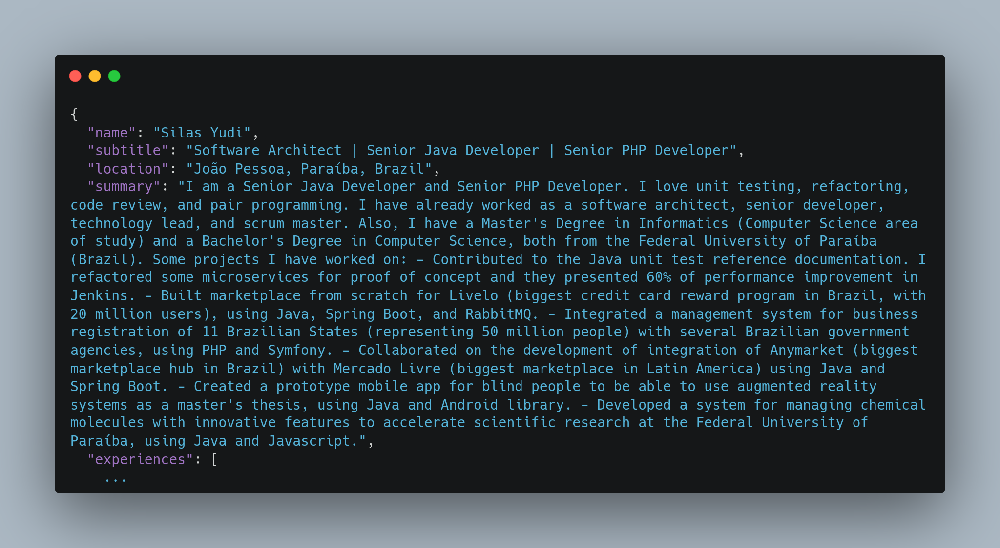

# Linkedin PDF Profile Parser

[](https://codeclimate.com/github/silasyudi/Linkedin-PDF-Profile-Parser/maintainability)
[](https://codeclimate.com/github/silasyudi/Linkedin-PDF-Profile-Parser/test_coverage)

## Presentation

This software export LinkedIn profile PDF like this...


...into JSON object:


This makes it possible for recruitment platforms to extract information from the PDF into a portable data 
structure and automatically fill in the forms.

### Information extracted

The information this software extracts is:
- Name
- Professional title
- Summary
- List of Experience
- List of Education
- Contact (email and LinkedIn URL)
- List of Top Skills
- List of Languages

### How export LinkedIn profile to PDF?

See how to export your LinkedIn profile to PDF
[here](https://www.linkedin.com/help/linkedin/answer/a541960/save-a-profile-as-a-pdf).

## Technologies

| Technologies  | Version   |
|---------------|-----------|
| Java          | 17        |
| SpringBoot    | 3.0.4     |
| Apache PDFBOX | 3.0.0-RC1 |
| MVN           | 3.9.0     |

## Demonstration

To launch the application, run the commands below. The application will start on port 8080.

```
mvn clean install
./mvnw spring-boot:run
```

By accessing the URL `localhost:8080` in your browser, you can use a web interface to attach your Profile.pdf in an
HTML form. The form will send a POST request to `/parse/multipart`.

The other exposed endpoint is `/parse`, which expects a body containing an array of bytes, in the JSON format below:

```json
{
    "file": [0,0,0,...]
}
```

## Format of JSON Response 

The format of JSON Response is:

```json
{
  "name": "Your name",
  "subtitle": "The professional title",
  "location": "city, state/department, country",
  "summary": "Your summary",
  "experiences": [
    {
      "company": "Company name",
      "title": "Professional title",
      "period": {
        "start": "Month Year",
        "end": "Month Year"
      },
      "location": "The location",
      "description": "The job description"
    }
  ],
  "educations": [
    {
      "school": "The university name",
      "degree": "Degree",
      "course": "Course name",
      "period": {
        "start": "Year",
        "end": "Year"
      }
    }
  ],
  "contact": {
    "email": "email@email.com",
    "linkedin": "www.linkedin.com/in/your-url"
  },
  "top_skills": [
    "Skill 1",
    "Skill 2",
    "Skill 3"
  ],
  "languages": [
    {
      "name": "Language",
      "proficience": "Description of proficience",
      "scale": 1
    }
  ]
}
```

